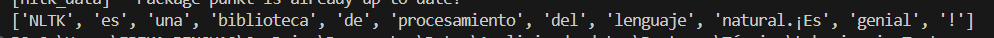

**ACTIVIDAD \#1:** 

**Actividad práctica** 

**Actividad práctica:** Como actividad práctica, se propone tokenizar textos utilizando herramientas como NLTK (Natural Language Toolkit) u otras disponibles. Esto permitirá aplicar los conceptos aprendidos sobre tokenización en un contexto práctico y familiarizarse con el uso de herramientas de procesamiento del lenguaje natural. Se explicará cómo tokenizar textos utilizando NLTK (Natural Language Toolkit), una biblioteca de procesamiento del lenguaje natural en Python. 

**Instalación de NLTK** 

Primero, es necesario instalar NLTK si aún no está presente. Esto se puede lograr utilizando pip, el gestor de paquetes de Python: 

**En el terminal de preferencia (Visual studio code, Pycharm etc).** 

`pip install nltk` 

**Importación de NLTK y Descarga de Recursos** 

Una vez instalado NLTK, se debe importar en el script Python. Además, es  necesario descargar recursos adicionales, como modelos y corpus, que NLTK utiliza para realizar ciertas tareas, como la tokenización. Esto se puede hacer ejecutando el siguiente código en un terminal de Python: 

`import nltk` 

`nltk.download('punkt')`  

**Tokenización de Textos** 

`from nltk.tokenize import word_tokenize` 

`texto = "NLTK es una biblioteca de procesamiento del lenguaje natural. ¡Es genial!"` 

`tokens = word_tokenize(texto)` 

`print(tokens)` 

Este anterior ejercicio en Python muestra la tokenilización por palabras

